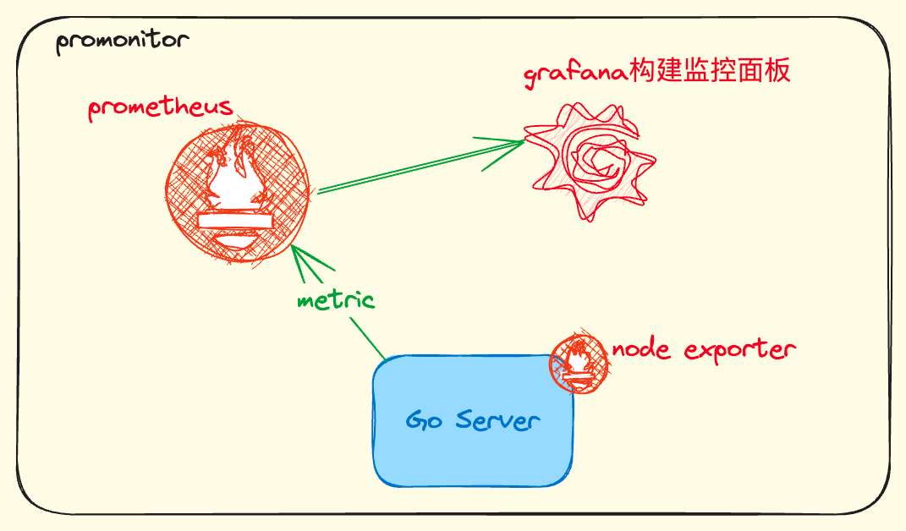

>大家好，我是Tia。这是一个基于prometheus和grafana的Go程序的监控系统。内容包括：
> 基于prometheus获取服务的指标
> docker部署prometheus和grafana
> grafana展示dashboard
> 等等

# 监控系统架构


# 命令操作
## 启动prometheus和grafana
```shell
# 编译server
sh build.sh
# 启动容器
docker-compose -f docker-compose.yml up -d
# 关闭
docker-compose -f docker-compose.yml down
# 查看服务启动情况
docker ps
```